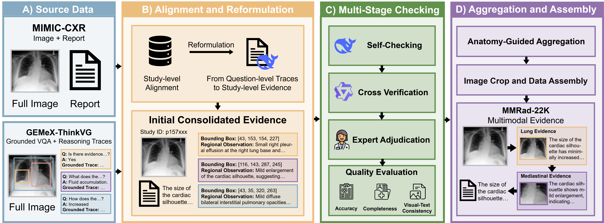
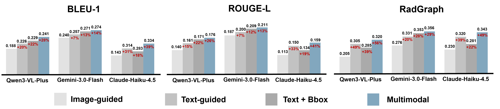
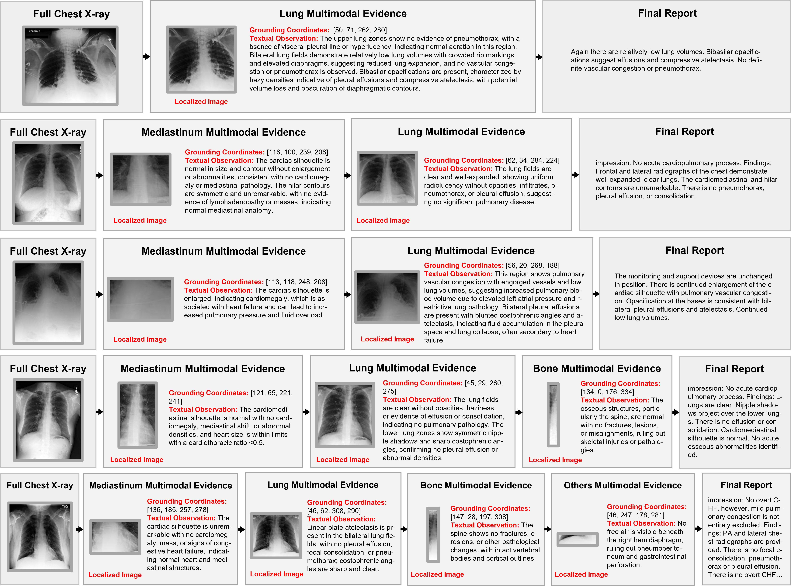

# MMRad-22K [EMNLP 2026 Findings]

<p align="center">
  📤 <a href="https://github.com/qiuzyc/thinking_like_a_radiologist" target="_self">Get Started</a> &nbsp; | &nbsp;
  📄 <a href="https://arxiv.org/abs/2602.12843" target="_blank">Preprint</a> &nbsp; | &nbsp;
  🤗 <a href="https://huggingface.co/datasets/Qiuzyc/MMRad-22K" target="_blank">Dataset</a>
</p>

<p align="center">

</p>

## News

[2026.08.21] Our paper was accepted by EMNLP 2026 as a Findings paper.

[2026.05.27] ArXiv preprint was released.

## Does Multimodal Evidence Help CXR Report Generation?

Localized textual and visual evidence can provide **complementary support** for CXR report generation.

<p align="center">

</p>

## MMRad-22K Dataset Examples

<p align="center">

</p>

## Anole-MMRad 

### Setup
Install requirements and `transformers`.
```
conda create -n anole python=3.10
conda activate anole
bash install.sh
```

### Training
#### Download Checkpoint
Set the `HF_HOME` and `repo_id` in `download_model.py` to the path of the base model checkpoint you want to download.

```
python download_model.py
```
Some reference checkpoints: [Anole-7b](https://huggingface.co/GAIR/Anole-7b-v0.1), [Anole-Zebra-CoT](https://huggingface.co/multimodal-reasoning-lab/Anole-Zebra-CoT) 

#### Tokenization
Tokenize the input to fit the training code. The input needs to be restructured to match the Anole format.
```
cd training
python tokenization.py
```
We also provide the example initial and tokenized input data in `./input_reference`.


#### Train Model with LoRA Adaptation
```
cd training
bash train.sh
```

### Inference
Inference consists of `inference.py` and `detokenization.py`. `combined.py` is used for unified calling.
```
cd inference
bash combined.sh
```

## TODO 
- [ ] Release training and inference codes
- [ ] Release full MMRad-22K dataset

## Acknowledgements
- [GeMeX-ThinkVG](https://huggingface.co/datasets/BoKelvin/GEMeX-ThinkVG)
- [Anole-Zebra-CoT](https://huggingface.co/multimodal-reasoning-lab/Anole-Zebra-CoT)
- [Thinking with Generated Images](https://github.com/GAIR-NLP/thinking-with-generated-images)

## Citation
Please consider citing our paper if it is helpful in your research and development.
```
@article{zhao2026mmrad,
  title={MMRad-22K: A Structured Multimodal Evidence Dataset for Chest X-ray Report Generation},
  author={Zhao, Yichen and Peng, Zelin and Tang, Fenghe and Yang, Piao and Huang, Yu and Shen, Wei},
  journal={arXiv preprint arXiv:2602.12843},
  year={2026}
}
```
